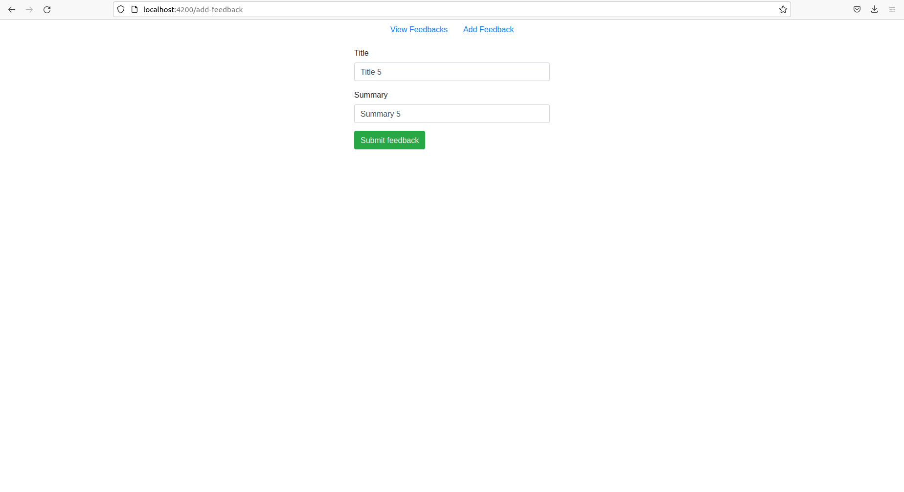
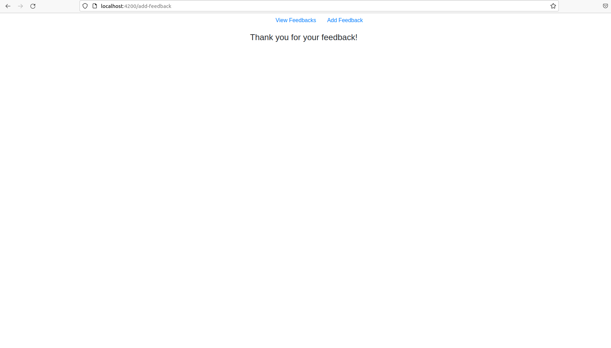
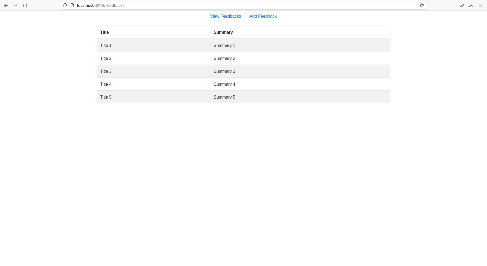

# Feedback App - An app developed using Django, MongoDB and Angular, used to collect feedback from users

## This app allows users to add a feedback and get a list of all the submitted feedbacks.

## Screenshots

Add a feedback


Thank you message after adding a feedback


View all submitted feedbacks


## How to run app
### First Way
The below docker images can be found [here](https://hub.docker.com/repository/docker/katmem/feedback_app/tags)
```
docker pull katmem/feedback_app:feedback_django
docker pull katmem/feedback_app:feedback_angular
docker run -t -d -p 8000:8000 katmem/feedback_app:feedback_django
docker exec -it <container_id_generated_by_previous_command> /bin/bash
python manage.py runserver 0.0.0.0:8000
docker run --rm -it -p 4200:80 katmem/feedback_app:feedback_angular
```

### Second Way
(requires .env file)
```
mkdir feedbackApp && cd $_
python3 -m venv venv
source venv/bin/activate 
git clone https://github.com/katmem/feedback-app.git
pip install -r feedback-app/feedbackProject/requirements.txt
cd feedback-app/feedback
npm install
ng serve
python ../feedbackProject/manage.py runserver
```
